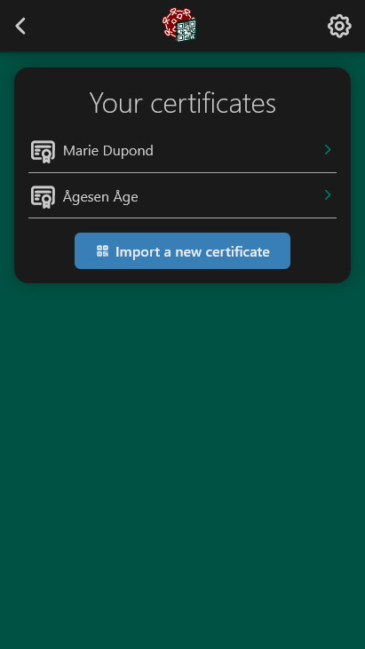
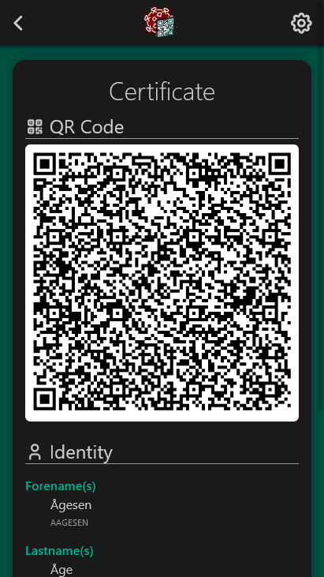

<div align="center">


# https://covid-certificate.app

A simple Progressive Web App to manage your EU Digital Covid Certificates.

*Stored only on your device - No internet connection necessary - No tracking scripts*


<hr>

 

<hr>
</div>

As COVID-19 is still looming around and some of its variants getting stronger, the European Union agreed upon using a common format for the certificates that proves an individual is vaccinated, has been tested negative recently, or has recovered from the disease. The certificate is available in a digitally signed QR Code, that can be scanned by verification apps to get access to some places.

This web app enables you to store on your device your certificates, without installing any native (and usually bloated) applications. You'll be able to show the QR Code whenever required, and also get some basic details out of the QR Code for you to see. The application can be added to your home screen for offline use.

# Usage

## Official domain

The application is officially accessible on https://covid-certificate.app. This version is automatically updated with the last commit on master, following the [Github Actions workflow](https://github.com/bchanudet/covid-certificate-pwa/blob/main/.github/workflows/main.yml) set up in this repository.

## From the sources

You can also compile the sources and host the build yourself, you'll need Node.js 14+ and npm: 

```sh
$ git clone https://github.com/bchanudet/covid-certificate-pwa.git
$ cd covid-certificate-pwa
$ npm install
$ npx ng build
```

Then copy all the files from `./dist/covid-certificate-pwa/browser` on any static host you want. You might need to configure the web server to match the router configuration of the application. Please see the [Angular docs](https://angular.io/guide/deployment#server-configuration) if you need more information.

# Developing

This application is a regular application developed with Angular 12. Node.js and npm are required. 

```sh
$ git clone https://github.com/bchanudet/covid-certificate-pwa.git
$ cd covid-certificate-pwa
$ npm install
$ ng s -o
```

At the current time, and given the limited scope of the application, no unit tests have been implemented.

# Contributing

*Every contribution to this repository must follow the [Contributor Covenant Code of Conduct](./CODE_OF_CONDUCT.md).*

## Bugs & feature requests

If you encounter a bug, please have a look at the list of [reported issues](https://github.com/bchanudet/covid-certificate-pwa/issues). If the bug has not been reported, please file a [new issue](https://github.com/bchanudet/covid-certificate-pwa/issues/new). Please try to put as much details as you can to help reproducing the bug. **Do not send a photo of your digital certificate.** The QR Code contains private information, and that will most likely not help to find the bug.

Given the limited time I can give to the project and because it already fulfills all my own needs, feature requests will only be evaluated on an exceptional basis.

## Translations

I will be very grateful for anyone willing to contribute translations to the application. As Angular's original localization process couldn't match my requirements (offline PWA + Hosted on Github Pages), the workflow was done by hand. Please follow the Wiki guide (coming soon) if you want to create a new translation.

## Pull requests

Any PR meant to fix a bug will be looked at and merged as soon as possible. Other PRs introducing new requests will be evaluated on several criteria like interest for the public, complexity of the code modifications, how much more maintenance it may bring to the project, etc. If you have any doubt you're welcome to file an issue to discuss it beforehand.

No unit tests have been implemented, and I won't enforce you to provide some with your PR. However some linting rules have been set up, please follow them by running `ng lint`.

# Contact

For any particular enquiry, you can contact me by email: covid-app@benjaminchanudet.com. Please refrain sending bugs to this email address, file a [new issue](https://github.com/bchanudet/covid-certificate-pwa/issues/new) instead.
